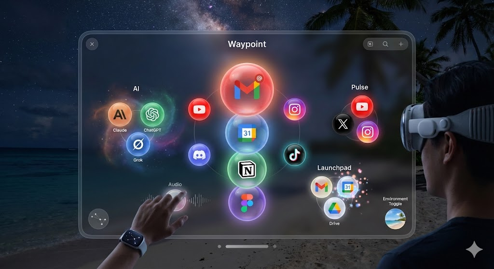
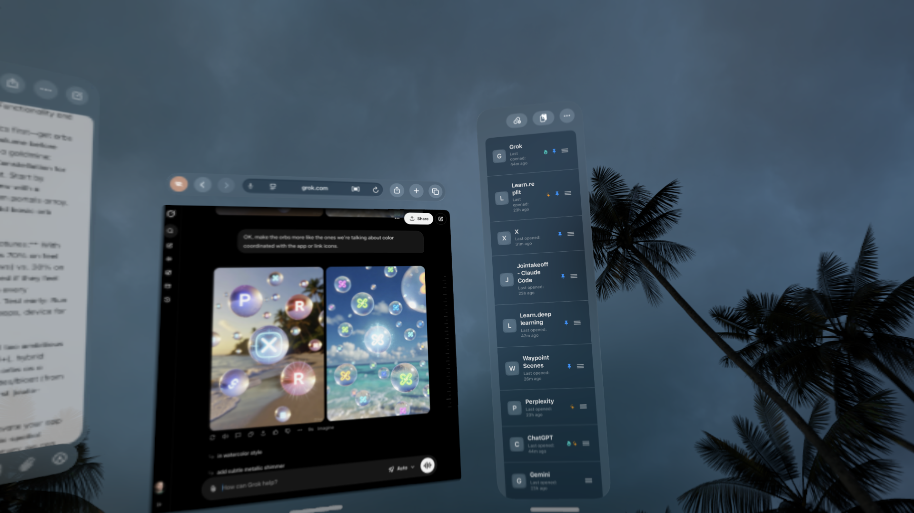
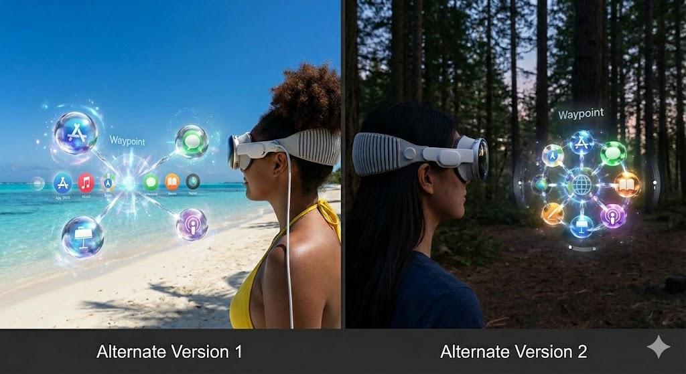
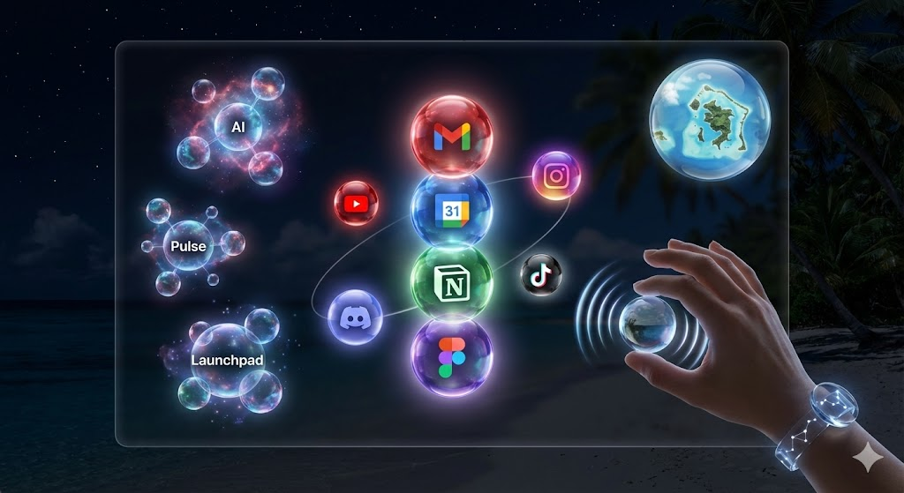

# Waypoint grock review  
  
Maybe we give command center /galaxy portal control  
- [ ] Summon portals  
- [ ] Paste portals/save them.  Links to main apps/ double animation  
  
**Final Breakdown of the Redesigned App**  
Based on our conversation, your current build (as shown in the screenshots: a clean list-based hub with context menus, filters, and quick-start groupings), and the new inputs (fully replacing the list with floating orbs as the primary UI, with lists as a prototype/backup mode; tying in orbs everywhere; floating nebula clusters; a spatial volume for dragging/throwing links to create orbs; alt pinned mode like paste; environment toggles like light/dark Bora Bora), here's the synthesized hybrid redesign. We're evolving Waypoint (or "Spatial Nexus") into an orb-centric spatial experience that's epic and immersive, while building directly on your MVP's functional core (e.g., Portal/Constellation models, persistence, and quick-add features). The list view becomes an optional "classic mode" toggle (e.g., via settings orb), but the default is a fully spatial, orb-based UI where portals float as interactive 3D entities in your mixed-reality space.  
**Core Structure:**  
* **Primary UI: Orb-Centric Spatial View.** Everything starts in a volumetric or unbounded space (your "spatial portal volume" idea). Orbs (portals) float freely or cluster into nebulae (constellations), replacing the list entirely for that "wow" factor. Users interact via gaze/pinch/drag— no flat windows unless toggled.  
* **Creation Flow:** Drag/throw links from other apps (e.g., Safari) into the app's always-active spatial volume to "bloom" new orbs (your love for portal bloom). If drag fails (as per your docs' finicky nature), fallback to a pinned "summon orb" mode (like your paste feature: Gaze + pinch to pull from clipboard/voice).  
* **Nebula Clusters:** Floating groups that orbit or snap magnetically (your floating nebula idea). Drag an orb into a nebula to add; long-press to edit (rename via mic, reorder).  
* **Modes and Transitions:** Fluid zoom (two-hand pull) from personal space (anchored orbs) to cosmos overview. Keep your quick-start as initial nebulae that users can expand.  
* **Environment Toggle:** A dedicated orb/link in the hub nebula swaps scenes (e.g., light/dark Bora Bora—your idea), enhancing immersion without leaving the app.  
* **Backup List:** Hidden toggle for "classic mode" (your list UI) if spatial feels overwhelming—activates a flat window overlay for editing/searching.  
* **Phased Build Path (from Your Current Build):** Start by extending your ImmersiveView to orb-ify the list (Phase 4 equivalent, ~4-6 hours). Add drag volume and blooms next (~3 hours). Nebula clustering and animations (~4 hours). Environment toggle last (~2 hours). Total MVP uplift: 15-20 hours, keeping your ~20-hour core.  
This hybrid keeps the app Vision Pro-exclusive, focusing on magic (blooms, floats, summons) to evoke smiles, while addressing pains like duplicates (auto-detect on add) and bloat (streamlined filters as orb tags).  
**Feasibility Assessment**  
Overall **high feasibility** (8/10)—VisionOS is built for this kind of spatial magic, and your MVP provides a strong base (e.g., data models are reusable). We're leveraging native APIs like RealityKit for orbs/animations (snappy at 60fps with <50 entities), ARKit for gestures/hand tracking (reliable for pinch/drag), and SwiftUI for any overlays. No external deps needed beyond your current stack. Key notes:  
* **Orb Replacement for List (Core Shift):** Highly feasible (9/10). RealityKit entities can represent portals as spheres with textures (favicons) and shaders for glows/blooms. Animations like blooming (scale + particles) are straightforward via Entity animations. Perf: Limit to 20-50 active orbs; cull off-screen ones. Build time: 4-6 hours extending your views.  
* **Spatial Portal Volume for Drag/Throw:** Medium-high (7/10). Volumetric windows support drag-drop (via .dropDestination modifiers), but as your FUTURE_DRAG_DROP.md notes, it's finicky across apps (e.g., Safari URLs may not register). Workaround: Use system drag (NSItemProvider for URLs) with fallbacks like clipboard monitoring. "Throwing" via physics (Collision/Force behaviors in RealityKit). Always-active: Run as a persistent entity in unbounded space. Risks: Latency on drop handling—test on device. Build time: 3-4 hours.  
* **Floating Nebula Clusters:** High (8/10). Group orbs as child entities in RealityKit hierarchies, with orbiting via animations or physics joints. Magnetic snapping: Proximity-based forces. Epic feel without complexity. Perf: Fine for small groups; scale with LOD. Build time: 4 hours.  
* **Pinned Alt Mode (Like Paste):** High (9/10). Similar to your existing paste: A floating "summon orb" entity that's gaze-activated, pulling from clipboard/voice. Feasibility: ARKit for gaze, AVSpeech for mic input. No issues.  
* **Environment Toggle (Light/Dark Bora Bora):** Medium (6/10). RealityKit supports custom environments via HDR textures or shaders for lighting. Toggling day/night: Swap Environment resources or adjust lighting configs. But full scene swaps (e.g., custom Bora Bora models) could hit perf/battery if complex—start with simple skybox changes. Feasibility: Native, but custom assets needed (USDZ imports). Build time: 2-3 hours; risks if over-customized.  
* **General Risks/Mitigations:** Battery drain in unbounded spaces—default to bounded volumes. Gesture fatigue—add voice fallbacks. App Store approval: All native, no issues. If drag fails entirely, emphasize voice/summon as primary (your ideas align here). Total: Feasible in your 20-30 hour roadmap; prototype orbs first to validate.  
If any part pushes feasibility low (e.g., drag), we can pivot to voice-heavy creation for that epic summon feel.  
**All Features Discussed (Organized by Category)**  
I've compiled every feature from our convos, your random ideas, docs, and new inputs. Categorized as requested, with notes on why they fit and feasibility ties.  
**Definitively Decided (Core to the Hybrid; Building These)**  
These are locked in based on your preferences (e.g., orb focus, blooms) and docs (e.g., portals, constellations).  
* Portal creation via drag/throw into spatial volume (blooms as new orbs; always-active when off-app).  
* Orb-based UI replacing lists (floating in space; lists as backup toggle).  
* Nebula clusters (floating orbital groups; drag to add, long-press to edit).  
* Auto-duplicate detection/merging on add (to handle "duplicates out of hand").  
* Portal bloom animation (emerge with particles/glow on creation/glance).  
* Pinned summon mode (gaze/voice to create orbs, like paste; alt for drag fails).  
* Constellation editing (swipe/reorder in spatial, mic rename).  
* Environment toggle (light/dark link swaps scenes, e.g., Bora Bora variants).  
* Basic portal interactions (pinch to expand/preview, flick to launch).  
* Filters as orb tags (streamlined: Remove date/name, prioritize custom/recent).  
**Most Epic (High-Wow Spatial Delights; Prioritize for Smile Factor)**  
These amp the magic—feasible post-MVP, but core to epic vibe.  
* Floating nebula expansions (gaze to orbit/reveal; epicenter grows with links).  
* Spatial audio cues (chimes on interact/launch; positional for immersion).  
* Custom group launch animations (cascade/wave effects for nebulae).  
* Hand/wrist pinning for summons (anchor constellations to hand for quick access).  
* Resonance links (orbs auto-connect if related, e.g., courses to PDFs).  
* Voice quick launch (1-button/mic for "Launch [nebula]"; 1-2 word Siri activation).  
**Basic Functionality (Essential Nuts-and-Bolts; Build on Your MVP)**  
These ensure usability—already in your build or easy extensions.  
* Portal CRUD (add/edit/delete/open; auto-fill names/favicons).  
* Constellation symbols as edge ornaments (drag-drop to add; like your menus).  
* Import from Safari/X (pull bookmarks/courses via URLs; basic metadata).  
* Course/PDF distinctions (unique tags/previews/progress via open count).  
* Quick access menu (rename via mic on button; filters moved to top).  
* Staggered launching (for groups; <2s total).  
**Interesting, But Likely Not Pursuing (Cool Ideas; Defer or Skip Due to Complexity/Low ROI)**  
These are intriguing but could bloat scope, hit feasibility walls (e.g., privacy/API limits), or duplicate efforts—park for v2 unless critical.  
* Full courses progress tracking (e.g., auto-resume; complex without web access).  
* Day/night auto-toggle (beyond manual; requires time APIs, but low epic value).  
* Pull from other apps like courses/apps (broad imports; privacy risks, defer to manual).  
* Orbital expansions on all (too perf-heavy if overdone; stick to nebulae).  
* Siri full integration (beyond basics; Apple restrictions on custom wake words  
  
  
Yes, exactly—to be crystal clear and lock this in:  
  
**Everything we're discussing is built entirely within volumes (volumetric windows) or immersive spaces in visionOS.** Nothing here requires or assumes breaking out into full-system windows, external apps, or non-volume experiences unless explicitly toggled as a fallback.  
  
### Quick Confirmation of Scope  
- The primary UI (floating orbs, nebula clusters, spatial portal volume for drag/throw creation) lives inside a **volumetric window** (bounded ~1.3m × 1.0m × 0.5m or similar, as per your current ImmersiveView and Phase 6/8.5 plans).  
- All interactions—gaze + pinch to bloom/expand orbs, drag to add to nebulae, long-press editing, orbital animations, spatial audio cues—are handled **within that volume** using RealityKit entities, attachments, gestures, and physics.  
- The "always-active spatial portal volume" for drag/throw creation is a **persistent volumetric entity** inside the app's main volume (or a dedicated creation sub-volume if we want separation). When the app is open and focused, that volume is visible and receptive to drops.  
- Environment toggles (light/dark Bora Bora, etc.) swap the RealityKit scene environment or skybox **inside the same volume**—no external scene changes.  
- Pinned summon orb, hand/wrist anchors, edge ornaments, mic rename, etc.—all anchored or attached **within the volume** via ARKit hand tracking and entity hierarchies.  
- The optional "classic list backup mode" would appear as a **SwiftUI overlay or secondary volumetric sub-window** inside the main volume (not a separate system window), so the user stays in the same spatial context.  
  
### Why This Matters (and Why It's Correct)  
- VisionOS apps are fundamentally volume-based or immersive-space-based experiences. Your current build already uses `WindowGroup` + `ImmersiveSpace` correctly, and everything we're layering on top (orbs replacing lists, nebula floating, drag bloom) fits **natively inside those volumes** without fighting the platform.  
- No need for full unbounded immersive space (Phase 9 style) for MVP—this stays in bounded volumetric windows for better battery life, easier onboarding, and lower risk of disorientation.  
- Drag/throw from external apps (Safari, Notes, etc.) into our volume works via system drag & drop targeting the app's drop destination (with the fallbacks we already discussed: clipboard/voice if it flakes).  
- Launching portals still opens in native apps (Safari, PDF viewers, etc.) as per your locked decisions—**we don't embed or take over**; we just summon them from within our volume.  
  
So yes—**volumes (volumetric windows) or immersive spaces only**. We're not talking about flat 2D windows, Share Extensions, widgets, or anything outside the app's spatial container unless it's a deliberate future phase (e.g., Phase 9 unbounded god-mode).  
  
If that aligns with your vision, we're golden. If you want to explicitly carve out any exceptions (e.g., "I actually do want one system-level widget for quick constellation summon"), just say the word and we can adjust. Otherwise, this keeps us 100% consistent with visionOS best practices and your existing architecture. Ready to move to implementation planning or code sketches next?  
  
Here are my **top 10 favorite features** for the redesigned Waypoint (Spatial Nexus) experience, ranked by how much delight, empowerment, and pure "this is why Vision Pro exists" magic they bring. I've included a mix of ones that already exist in your current build, ones we've heavily outlined in our conversation, and a few natural evolutions that feel inevitable once the orb-centric volume is the heart of the app.  
  
1. **Orb Bloom on Creation**    
   The absolute winner. That moment when you drag/throw a link (or summon via voice/clipboard) and a new portal orb blooms out of your hand with particle burst, subtle glow, and haptic feedback—it's pure wizardry. It turns a mundane "add bookmark" action into something that makes you smile every single time.  
  
2. **Floating Nebula Clusters (Orb Groups in Orbit)**    
   Nebulae that magnetically snap, orbit a larger epicenter orb (which grows with more portals), and feel alive. Dragging an orb into one, watching it join the formation with a satisfying chime—this is the spatial grouping we dreamed of. It makes workflows feel like personal constellations you physically command.  
  
3. **Spatial Portal Volume for Ambient Creation**    
   The always-present (or summonable) volumetric drop zone where you can casually throw links from Safari/Notes/anywhere and they bloom as orbs inside your app. Combined with the pinned summon-orb fallback, it removes almost all friction from adding content. Feels like the app is always "open" to receive your digital life.  
  
4. **Gaze + Pinch to Expand / Highlight Glow**    
   Looking at an orb and pinching makes it rapidly expand into a beautiful preview bubble (favicon enlarged, title floating, quick snippet if applicable), with the outer glow brightening on gaze. It's effortless, intuitive, and makes every orb feel responsive and important.  
  
5. **Custom Group Launch Animations + Spatial Audio Cascade**    
   When you launch a whole nebula: orbs ripple out in a wave, staggered slightly (0.05–0.3s delays), each one chiming with positional spatial audio as its native app opens. The combination of visual poetry + sound design creates that epic "summoning a workflow" moment.  
  
6. **Hand/Wrist Pinning for Quick-Access Constellations**    
   Anchoring your most-used nebula (e.g., "Morning Routine" or "Deep Work") to your wrist or palm via hand tracking. A subtle flick or open-palm gesture brings it forward—feels like wearing a spatial utility belt. Super practical and delightfully futuristic.  
  
7. **Environment Toggle (Light ↔ Dark Bora Bora, etc.)**    
   A single orb or gesture that instantly swaps the RealityKit environment—daytime tropical beach to starry night version of the same scene. It’s low-effort immersion control that makes the whole volume feel like your personal sanctuary. (Bonus: subtle aurora or particle effects during transition.)  
  
8. **Voice Quick Launch + Mic Rename**    
   Gazing at a nebula and saying “Launch Morning” (or tapping the floating mic orb and speaking) to fire everything off. Similarly, long-pressing an orb and dictating a new name. Voice feels magical in spatial computing—reduces hand fatigue and adds that HAL-9000-level agency.  
  
9. **Edge Ornaments for Constellation Symbols**    
   The slim floating icons along the left/right edges of the volume that represent your main nebulae. Drag-drop portals onto them to add, long-press to edit/reorder/rename. Keeps the main space clean while giving fast access to groups—very practical elegance.  
  
10. **Backup Classic List Mode (Toggleable Overlay)**    
    The quiet hero. When you need to do serious editing, searching, or bulk operations, toggle into the familiar vertical list view as a semi-transparent overlay inside the same volume. It preserves your current working list UI as a safety net without ever leaving the spatial context.  
  
### Quick Honorable Mentions (would be 11–13 if I extended the list)  
- Auto-duplicate detection + merge prompt on add    
- Portal epicenter scaling (larger central orb as nebula grows)    
- Resonance auto-connections between related orbs    
  
These 10 capture the soul of what we've been building toward: a Vision Pro app that doesn't just manage links—it makes you feel like you're conducting your digital universe with effortless, joyful spatial magic.  
  
Which of these excite you the most right now? Or is there one you'd bump higher / swap out?  
  
Orbs are the heart of what we're turning this app into—a spatial, immersive link hub that feels magical on Vision Pro. I'll break this down step by step based on our vision from the conversation, your current build, and how we'd actually implement it. Since you're emphasizing an MVP start with iteration (smart call—keeps things shippable without overwhelming the codebase), I'll frame everything around that. Yes, this is all in Swift code—no external engines or non-native tools needed. We're leveraging RealityKit (for the 3D magic) and SwiftUI (for any 2D overlays like labels or previews), which aligns perfectly with your existing setup (e.g., ImmersiveView, ContentView). No Objective-C or other languages; it's pure Swift for VisionOS.  
  
### What We Envision the Orbs Looking Like  
Picture orbs as floating, ethereal 3D spheres in your volumetric space—think glowing crystal balls from a sci-fi wizard's lair, but grounded in productivity. They're not just static icons; they're dynamic entities that respond to you, evoking that "wow, this is Vision Pro" smile. Here's the visual breakdown:  
  
- **Core Appearance:** Semi-transparent glass-like spheres (about 5-10cm diameter in spatial scale) with a subtle inner glow. The favicon or thumbnail (from your auto-fetch) textures the surface or hovers inside like a captured essence. For example, a Gmail orb might have a red envelope icon pulsing faintly. Colors are customizable (e.g., blue for work, green for personal) with a soft aura that intensifies on gaze or proximity—drawing your eye naturally without overwhelming the scene.  
    
- **States and Variations:**  
  - **Idle:** Gentle bob or subtle rotation, like they're alive but calm. Low-opacity glow to blend into your Bora Bora backdrop without clutter.  
  - **Hovered (Gaze):** Brighter outer glow (your highlighted constellation idea), slight scale-up (1.1x) for feedback.  
  - **Selected (Pinch):** Blooms open with a particle burst—expands to reveal a preview bubble (title, snippet, or 3D thumbnail for USDZ/PDFs).  
  - **Grouped (Nebula):** Smaller satellite orbs orbiting a larger central one (epicenter grows with more links, as you mentioned). Magnetic snap with a soft "click" haptic when dragging one in.  
  - **Special Types:** Courses/PDFs could have progress rings around the orb (e.g., a glowing arc showing 50% complete). Duplicates fade or merge visually with a warning glow.  
  
- **Overall Vibe:** Cosmic and intuitive— orbs feel tactile and responsive, like you could pluck them from the air. In a dark Bora Bora toggle, they might cast soft light reflections on virtual "ground." This ties into your epic features like spatial audio chimes on interact or cascade animations on launch.  
  
The goal: Orbs make the app feel less like a bookmark manager and more like summoning portals in your personal universe. Start MVP with basic spheres, then layer in glows/animations for polish.  
  
### Is It All Going to Be Swift Code?  
Yep, 100% Swift— no shaders in Metal (unless we go ultra-advanced later), no third-party libs. VisionOS is designed for this:  
- **RealityKit Handles the 3D Core:** For creating the orb entity (a sphere mesh), adding materials (for glow/transparency), animations (bloom/scale), and interactions (gestures, physics for orbiting/snapping).  
- **SwiftUI for Attachments:** Overlays like floating labels (e.g., portal name) or previews attach directly to RealityKit entities via `Attachment` views—keeps it hybrid without clunk.  
- **ARKit Integration:** For hand/gaze tracking (e.g., pinch to select)—native in VisionOS, no extra code beyond session delegates.  
- **No Other Languages/Tools:** Everything compiles in Xcode. Your current project (WaypointApp, ImmersiveView) is already set up for this—extend `RealityView` or `ImmersiveSpace` to spawn orbs.  
  
If we hit perf walls (e.g., 50+ orbs), we'd optimize in Swift (e.g., level-of-detail models), but MVP stays lightweight.  
  
### Other Levels of Orb Build-Out to Consider  
Think of orbs in tiers—start at MVP (basic functionality) and iterate up. This balances the "ton of crazy functionality" without boiling the ocean. Each level builds on the last, so we can ship early and add wow later (e.g., Phase 4: Basic orbs; Phase 6: Interactive; Phase 8: Advanced).  
  
1. **MVP Level (Basic: Static Visuals – ~2-4 Hours Build)**  
   - Simple sphere entities via `MeshResource.generateSphere(radius: 0.05)`.  
   - Basic material: `SimpleMaterial(color: .blue, isMetallic: false)` with favicon as a texture (load via `TextureResource`).  
   - Position them floating in the volume (e.g., in a grid or random scatter initially).  
   - Core interaction: Gaze to highlight (change color), pinch to launch (open URL in Safari).  
   - Why Start Here: Gets the orb UI replacing your list quickly. Ties into your existing Portal model—each orb is an Entity with a Portal component attached.  
   - Balance: Focus on core app flow (add/launch) before fancy stuff. Bail if perf sucks by falling back to list.  
  
2. **Interactive Level (Gestures & Feedback – +3-5 Hours)**  
   - Add glow/bloom: Use `PhysicallyBasedMaterial` with emission for auras; animate scale/opacity on gaze/pinch.  
   - Drag/reorder: Enable `InputTargetComponent` and `DragGesture` for moving orbs in space.  
   - Nebula basics: Group as child entities; simple orbiting via `AnimationController`.  
   - Preview bubble: On expand, spawn a child entity with SwiftUI attachment (e.g., `Text(portal.name)` overlay).  
   - Balance: This is where interactions shine—prioritize gaze/pinch over complex physics to avoid latency. Test on device early; if too much, simplify to tap-only.  
  
3. **Advanced Level (Delights & Physics – +4-6 Hours, Post-MVP)**  
   - Physics/collisions: Add `PhysicsBodyComponent` for bouncing/snapping (e.g., magnetic forces via joints).  
   - Animations: Bloom particles with `ParticleEmitterComponent`; cascade launches with sequenced timelines.  
   - Spatial audio: Attach `AudioPlaybackController` for positional chimes (e.g., higher pitch for course orbs).  
   - Customizations: User-set colors/tags via material swaps; progress rings as orbiting sub-entities.  
   - Crazy Extras: Resonance (orbs attract if related—use distance checks); wrist pinning (anchor to hand entity via ARKit).  
   - Balance: Defer these if they bloat—e.g., only add physics if under 30 orbs. Bail on anything that drops below 60fps or complicates your constellation editing.  
  
### My Thoughts on Balancing Functionality and Interactions  
- **MVP Mindset:** Nail the basics first—get orbs rendering and tappable in your volume before animations. Your current build is a goldmine: Reuse PortalManager for data, Constellation for grouping, and Quick Add for input. Start by swapping your list in PortalListView with a RealityView that spawns orbs from portals array. Iterate in small commits (e.g., "Add basic orb entity" → "Add gaze glow").  
    
- **Prioritize Interactions Over Features:** With "tons of crazy functionality," focus 70% on feel (smooth gestures, responsive glows) vs. 30% on bells (audio, physics). Orbs succeed if they feel intuitive—e.g., don't overload with every animation if it means laggy drags. Test early: Run on Vision Pro simulator for quick loops, device for real spatial feel.  
    
- **Bail-Out Strategy:** If orbs feel too ambitious (e.g., RealityKit perf issues with 20+), hybrid fallback: Keep list as primary, with orbs as a "spatial mode" toggle. For duplicates/bloat (from your notes), handle in data layer first (auto-merge) before visual cues.  
    
- **Why This Excites Me:** Orbs elevate your app from "useful bookmark tool" to "epic spatial nexus." Starting MVP keeps momentum; we can always add the crazy stuff (like voice summons) in updates. If you share your current orb code experiments, I can refine specifics! What's your first step—basic sphere prototype?  
  
   
  
  
  
  
  
